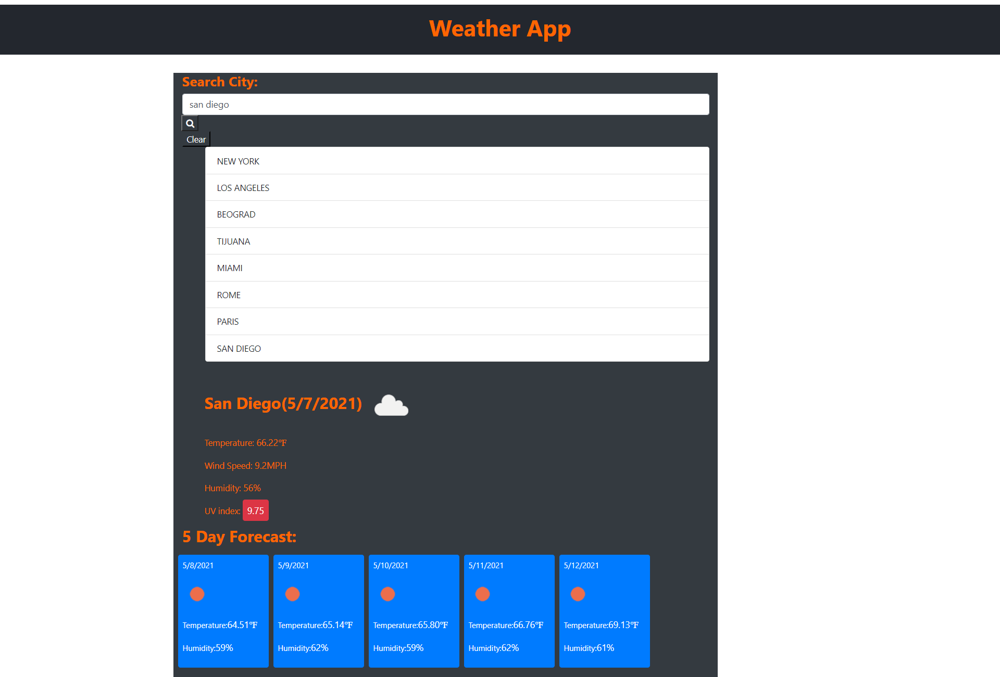

# 06_Weather_App

UCSD-SD-FSF-PT-03-2021-U-C-MW

## Github repository and published webpage links below

[GitHub link](https://github.com/djony88/Weather_App)

[Published Webpage](https://djony88.github.io/Weather_App/)

Requirements:

* Create weather dashboard with history of searched cities and multiple day forecast.
* When serched for specific city current conditions and for next 5 days are presented and city name is added to search history.
* In serched current weather condition presented are city name, current date, icon presenting current weather condition, temperature, humidity, wind speed and UV index.
* UV index is presented with diferent color wether the conditions are favorable, moderate, or severe.
* Future wether conditions are presented in 5-day forecast that is presented with date, an icon representation of weather conditions, temperature, and humidity.
* When clicked on city from history it presents again the current and future weather conditions for selected city.

HTML:

* Added bootstrap and linked CSS file.
* Added title.
* Added search bar and history.
* Added current forecast.
* Added Search button.
* Added Clear button.
* Added current temperature, wind speed, humidity and UV index.
* Added future 5 day forecast.
* Added jquery and ajax scrypt.
* Linked JavaScript file.

CSS:

* Font syling
* 5 day forecast styling.
* Hover search history styling.

JavaScript:

* Variable declaration.
* Checks input if it exist in local storage history.
* Open weather API key.
* Ajax function w/ API URL, parse response for city name and concating icon and date, current temp in Farenheits, wind speed in MPH, current humidity and UV index.
* UV index response w/ UV index API url.
* User input search history.
* Display search history from local storage.
* Render search history function from local storage.
* Search history clear button.
* 5 day forecast.
* On click handlers.

